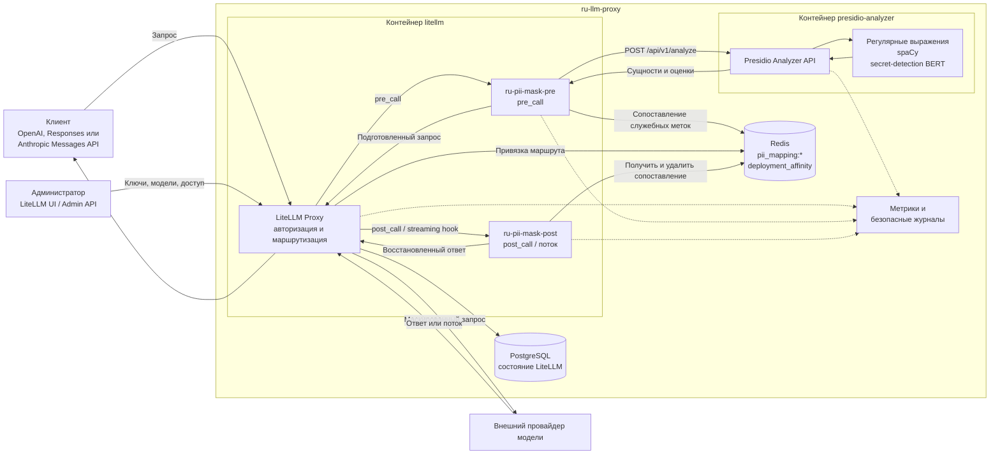
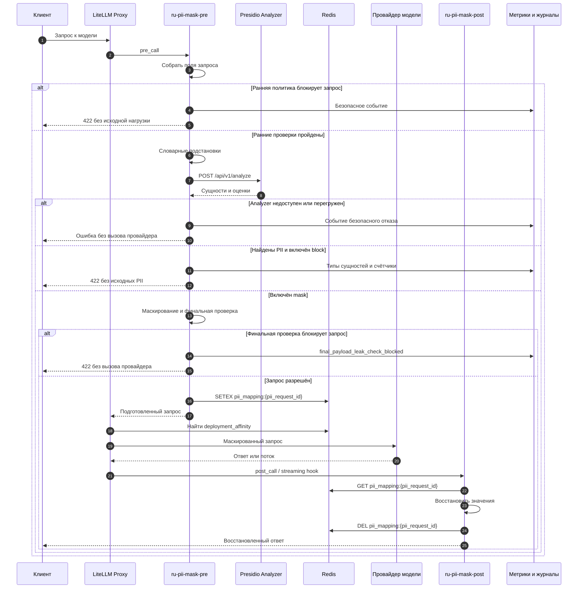

# Архитектура

Документ описывает компоненты, поток запроса и границы данных текущей реализации.
Настройки собраны в [configuration.md](configuration.md), команды проверки — в
[examples.md](examples.md), эксплуатационные действия — в
[monitoring.md](monitoring.md).

## Компоненты

| Компонент | Ответственность |
| --- | --- |
| LiteLLM Proxy (`litellm`) | API-шлюз, проверка клиентских ключей, выбор провайдера модели, запуск защитных обработчиков |
| PII Guardrail (`litellm_guardrails/pii_guardrail.py`) | Ранние политики, маскирование, блокировка и восстановление ответа |
| Presidio Analyzer (`presidio-analyzer`) | Детерминированные распознаватели, spaCy и закреплённая BERT-модель |
| Redis (`redis`) | Временные сопоставления служебных меток и привязка клиента к провайдеру модели |
| PostgreSQL (`db`) | Состояние LiteLLM |

## Компонентная схема

Схема не включает внешний обратный прокси.



## Последовательность обработки

Основная ветка показана для `PII_GUARDRAIL_MODE=mask`. В режиме `block` запрос
завершается после обнаружения персональных данных.



## Порядок защитных слоёв

1. LiteLLM запускает `ru-pii-mask-pre` для `/v1/chat/completions`,
   `/v1/responses` или `/v1/messages`.
2. Обработчик собирает строки, которые могут уйти провайдеру: `messages`,
   `input`, `instructions`, верхнеуровневый `system` в Anthropic Messages,
   аргументы и результаты инструментов.
3. `REGULATED_TOPIC_POLICY_MODE=block` останавливает уверенно распознанные
   регулируемые темы.
4. `PRE_EGRESS_POLICY_MODE=block` проверяет исходную полезную нагрузку до
   `POST /api/v1/analyze` и блокирует конфигурации, журналы и трассировки.
5. Включённые словарные правила выполняют обратимые бизнес-подстановки.
6. Analyzer возвращает сущности, границы и оценки; список разрешённых
   синтетических значений исключает только явно заданные тестовые совпадения.
7. В режиме `block` наличие PII завершает запрос. В режиме `mask` обработчик
   создаёт служебные метки и заменяет найденные значения.
8. `FINAL_PAYLOAD_LEAK_CHECK_MODE=block` проверяет итоговую нагрузку. В область
   входят `messages`, `input`, `instructions`, `system`, `tools`, `tool_choice`,
   устаревшие `functions`, `function_call`, `prediction`, `response_format`,
   `text`, `extra_body`, `stop`, `stop_sequences`, `prompt_cache_key`,
   `safety_identifier`, `web_search_options`, `user` и `metadata`.
9. При блокировке финальной проверкой обработчик откатывает маскированный текст и
   словарные подстановки, возвращает `final_payload_leak_check_blocked` и не
   создаёт сопоставление в Redis.
10. Разрешённый запрос получает серверный `pii_request_id`. Сопоставление
    сохраняется в `pii_mapping:<pii_request_id>`, а LiteLLM выбирает провайдера.
11. `ru-pii-mask-post` восстанавливает обычный ответ. Потоковый обработчик
    восстанавливает `delta.content` и `delta.reasoning_content`, в том числе если
    служебная метка разорвана между фрагментами.
12. Сопоставление удаляется после ответа или завершения потока.

Пример:

```text
Вход:       Телефон +79031234567, ИНН 7707083893
Провайдеру: Телефон <PHONE_NUMBER_1>, ИНН <RU_INN_1>
Redis:      <PHONE_NUMBER_1> -> +79031234567
            <RU_INN_1>       -> 7707083893
```

## Политики

### Персональные данные и отказ зависимостей

`PII_GUARDRAIL_MODE=mask` маскирует PII и восстанавливает ответ;
`PII_GUARDRAIL_MODE=block` возвращает безопасную ошибку `422` до вызова
провайдера. Ошибка не содержит исходный текст, значения или смещения.

`PII_GUARDRAIL_FAILURE_MODE=fail_closed` является значением по умолчанию:
сбой Analyzer или Redis блокирует запрос. `fail_open` допустим только как
осознанное исключение. Перегрузка Analyzer (`analyzer_overloaded`) и
недоступность обязательной NER-модели всегда приводят к fail-closed независимо
от `PII_GUARDRAIL_FAILURE_MODE`.

### Словарные подстановки

`DICTIONARY_SUBSTITUTIONS_ENABLED=true` заменяет настроенные бизнес-термины до
Analyzer и хранит обратное сопоставление вместе с PII. Базовый файл
`dictionary-substitutions.default.json` содержит десять российских банков.
Неоднозначная или некорректная конфигурация блокирует запрос при
`DICTIONARY_SUBSTITUTIONS_FAILURE_MODE=fail_closed`. Восстановление требует
точного совпадения с заменой, которую вернула модель.

### Синтетические данные

`SYNTHETIC_PII_ALLOWLIST_MODE=allow` исключает из обработки только значения,
совпавшие с безопасными правилами `SYNTHETIC_PII_ALLOWLIST_JSON`. По умолчанию
режим выключен. Он предназначен для synthetic/test-наборов, а не для реальных
данных в промышленной среде. Исходные разрешённые значения не попадают в
журналы; срабатывания считает `ru_synthetic_pii_allowlist_hits_total`.

### Регулируемые темы

`REGULATED_TOPIC_POLICY_MODE=block` останавливает внутренние материалы по
AML/CFT / ПОД/ФТ, санкционным проверкам и мониторингу транзакций только при
высокой уверенности. Эта политика не является распознавателем персональных данных,
не создаёт служебные метки и не пишет исходный текст. Код ответа —
`regulated_topic_policy_blocked`, метрика —
`ru_regulated_topic_policy_blocked_total`.

### Проверки до выхода к провайдеру

Предварительная политика обнаруживает исходные `.env`, kubeconfig, манифесты
Kubernetes, конфигурации nginx, журналы и трассировки до `POST /api/v1/analyze`;
код ответа — `pre_egress_policy_blocked`.

#28, вторичная DLP-проверка, реализована отдельно как финальная проверка уже
изменённой полезной нагрузки. Она сканирует, но не расширяет PII-маскирование на
служебные поля провайдера. Эти прикладные слои дополняют, но не заменяют
сетевую политику: [docs/egress-controls.md](egress-controls.md) и
[`deploy/kubernetes/egress`](../deploy/kubernetes/egress).

## Analyzer

Analyzer — FastAPI-приложение в `presidio/analyzer_server.py`. Защитный
обработчик вызывает `POST /api/v1/analyze`; без этого сервиса автоматическая
проверка персональных данных не работает.

### Источники обнаружения

| Источник | Сущности |
| --- | --- |
| Детерминированные распознаватели | `PHONE_NUMBER`, `EMAIL_ADDRESS`, `RU_INN`, `RU_KPP`, `RU_OGRN`, `RU_OGRNIP`, `RU_BIK`, `RU_SETTLEMENT_ACCOUNT`, `RU_CORRESPONDENT_ACCOUNT`, `RU_SNILS`, `RU_PASSPORT`, `CREDIT_CARD`, `RU_ADDRESS`, `INTERNAL_IP`, `INTERNAL_DOMAIN`, `HOSTNAME`, `DB_URL`, `JWT`, `BEARER_TOKEN`, `PRIVATE_KEY`, `API_KEY`, `SECRET_KEY`, `AUTH_TOKEN`, `LOGIN`, `PASSWORD` |
| BERT | `PERSON`, `LOCATION`, `ORGANIZATION`, `LOGIN`, `PASSWORD`, `AUTH_TOKEN`, `SECRET_KEY`, `CONTRACT_NUMBER` |

Распознаватели инфраструктуры и секретов работают с отдельными сущностями, а
не как классификатор всей полезной нагрузки. Общий поиск по энтропии и полный
набор Gitleaks не используются из-за ложных срабатываний. `RU_ADDRESS` намеренно
ограничен распространёнными структурированными формами адреса; свободный текст,
индексы и неоднозначные фразы покрываются не полностью.

### Объединение результатов

Analyzer сохраняет внутренний источник результата и разрешает пересечения по
фиксированному приоритету:

1. Точное значение учётных данных имеет приоритет над широким фрагментом.
2. `PRIVATE_KEY`, `DB_URL`, `JWT` и `API_KEY` имеют приоритет над общим секретом.
3. Валидируемая структура имеет приоритет над NER.
4. Оценка сравнивается только внутри одного класса источников; затем применяются
   стабильные границы и имя сущности.

`CONTRACT_NUMBER` требует слов `договор`, `контракт`, `соглашение`, `contract`
или `agreement`. Если BERT пропустил номер или захватил служебные слова, строгий
контекст создаёт резервный результат с оценкой `0.85`. Версии, даты и случайные
коды отбрасываются. Метрика `ru_presidio_analyzer_merge_decisions_total`
фиксирует решение без текста и смещений.

### Пороги и проверка структуры

API использует `score_threshold=0.35`. Контрольная сумма обязательна для
`RU_INN`, `RU_OGRN` и `RU_OGRNIP`. При
`PRESIDIO_ANALYZER_DETECT_BARE_INN_BY_CHECKSUM=true` корректный 12-значный ИНН
проходит порог без контекста; 10-значный ИНН требует контекст. При `false` любой
ИНН без контекста остаётся ниже порога.

`RU_KPP`, `RU_BIK`, `RU_SETTLEMENT_ACCOUNT` и `RU_CORRESPONDENT_ACCOUNT`
требуют контекст. Счета проверяются по контрольному ключу, если рядом есть БИК;
Analyzer не выполняет онлайн-проверку справочника Банка России.

`INTERNAL_IP` использует `ipaddress`; публичные адреса добавляются только при
`PRESIDIO_ANALYZER_DETECT_PUBLIC_IPS=true`. `INTERNAL_DOMAIN` ограничен
настроенными суффиксами. `HOSTNAME`, `LOGIN`, `PASSWORD`, `SECRET_KEY` и
`AUTH_TOKEN` требуют строгий контекст. `JWT` должен иметь декодируемые JSON-части,
а `API_KEY` покрывает только известные форматы провайдеров.

### NER-модель

spaCy `ru_core_news_sm` обеспечивает токенизацию и базовую языковую обработку
Presidio. Закреплённая `fef2/ner_rus_bert-secret_detection` подключена отдельно
через `presidio/ner/huggingface_recognizer.py`; одна модель не является
обёрткой над другой.

Модель обязательна. При старте Analyzer проверяет манифест, архитектуру,
токенизатор, метки и выполняет прогрев. Состояния: `not_loaded`, `loading`,
`warming_up`, `ready`, `failed`. Только `ready` принимает запросы. Ошибка
артефакта, загрузки, прогрева или выполнения модели переводит NER в `failed`;
запросы получают `503 required_ner_unavailable` до перезапуска. Ошибка обработки
конкретного текста отклоняет только этот запрос и не меняет готовность модели.

NER запускается только если запрошенные `entities` пересекаются с её восемью
типами. Оценка сущности равна минимальной вероятности её токенов, а порог
применяется до округления.

Внутри NER текст приводится к Unicode NFC с отображением каждого символа на
исходный диапазон. Исходный запрос и результаты других распознавателей не
изменяются. Одна токенизация разбивается на окна до 384 содержательных токенов
с перекрытием 64; граница выбирается по абзацу, затем по предложению, затем по
жёсткому пределу. Перекрывающиеся результаты одного типа объединяются. Если
остаются только возможные обрезанные фрагменты, спорная граница один раз
проверяется дополнительным окном, смещённым к центру. Неразрешимая
неоднозначность приводит к безопасной ошибке только текущего запроса.

### Ёмкость и зависимости

Один процесс Analyzer по умолчанию выполняет один анализ и допускает очередь из
восьми запросов. Каждый процесс загружает собственные spaCy и BERT, поэтому
память растёт примерно линейно. Точные значения
`PRESIDIO_ANALYZER_WORKERS`, `PRESIDIO_ANALYZER_CONCURRENCY_LIMIT`,
`PRESIDIO_ANALYZER_QUEUE_LIMIT` и таймаутов приведены в
[configuration.md](configuration.md).

Защитный обработчик переиспользует HTTPX- и Redis-клиенты в пределах процесса и
цикла событий. `close_guardrail_dependency_clients()` закрывает их при
завершении встраиваемого запуска. Лимиты соединений не увеличивают вычислительную
ёмкость Analyzer.

## Данные и хранение

- Провайдер получает подготовленный, обычно маскированный запрос.
- Redis временно хранит исходные значения для восстановления с TTL.
- Привязка `deployment_affinity` содержит хэш клиентского ключа и постоянный
  `model_info.id`, но не исходный ключ.
- PostgreSQL хранит состояние LiteLLM, но не сопоставления PII.
- Метрики и структурированные журналы не содержат текст запроса, найденные
  значения или смещения.

Подробности маршрутизации: [routing.md](routing.md). Границы административного
доступа: [admin-access.md](admin-access.md).

## Сборка модели

`presidio/model_manifest.json` закрепляет модель, ревизию, лицензию, размеры и
SHA-256 разрешённых файлов. Независимая стадия `model-download` проверяет их при
сборке, поэтому изменение Python-зависимостей не требует повторной загрузки
весов. Рабочий образ использует только локальные файлы с `HF_HUB_OFFLINE=1`,
`TRANSFORMERS_OFFLINE=1`, `local_files_only=True` и `trust_remote_code=False`.

Сборочная цель `analyzer-build` устанавливает `torch==2.13.0+cpu` отдельно от
общих библиотек. Цель `analyzer-test` наследует сборочные библиотеки, добавляет
`pytest` из `requirements-analyzer-test.txt`, но не получает веса NER. Рабочая
цель `analyzer` создаётся из чистого базового образа и не содержит `pytest`,
компиляторы, `curl` или CUDA-зависимости. Выполнение на видеокарте не
поддерживается.

Происхождение модели и порядок обновления описаны в
[research/ner-model-provenance.md](research/ner-model-provenance.md).

## Проверки состояния

LiteLLM использует не требующий ключа `GET /health/liveliness`; `/health` может
обращаться к моделям. Analyzer через `GET /api/v1/health` сообщает состояние,
ревизию и ёмкость NER. Метрики и действия при сбоях собраны в
[monitoring.md](monitoring.md).

## Ограничения

- Изменённая моделью служебная метка не восстанавливается.
- Потоковые аргументы вызовов инструментов пока не восстанавливаются.
- Длинный запрос требует нескольких последовательных проходов BERT.
- Сущность, которую нельзя полностью увидеть ни в исходных, ни в дополнительном
  окне, приводит к безопасной ошибке текущего запроса.
- Ограничения Python-зависимостей не являются полным lockfile с хэшами.
