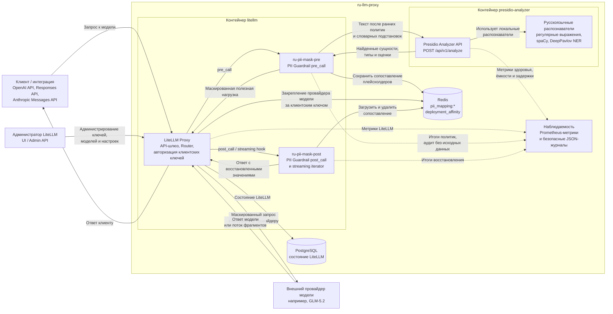
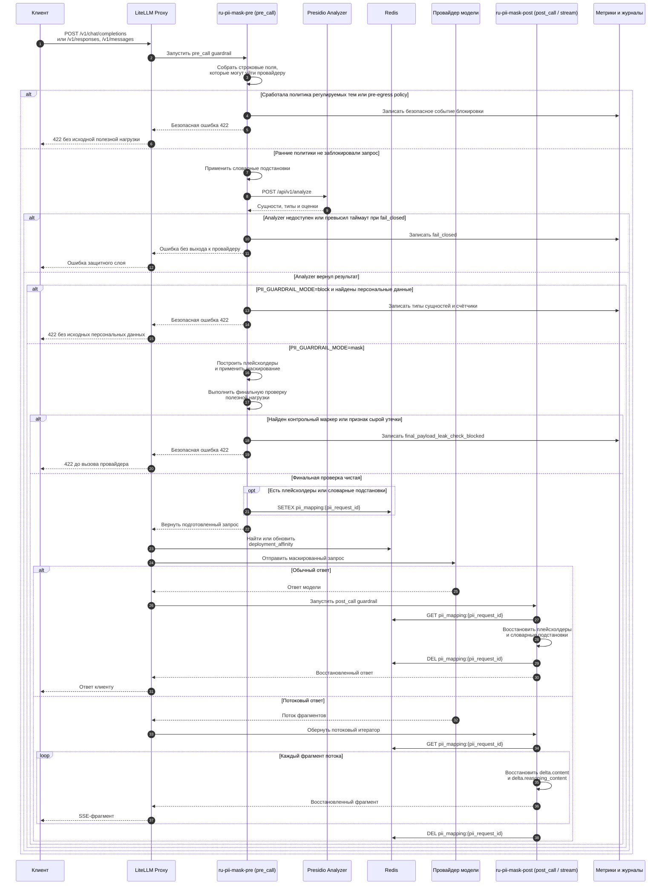

# Архитектура

Документ описывает текущую реализацию `ru-llm-proxy`.

## Компоненты

| Компонент | Сервис | Ответственность |
| --- | --- | --- |
| LiteLLM Proxy | `litellm` | Шлюз, совместимый с OpenAI API, закрепление маршрута за провайдером модели, выполнение защитных слоёв LiteLLM |
| PII Guardrail | `litellm_guardrails/pii_guardrail.py` | Маскирование персональных данных в запросах, сопоставления в Redis, восстановление ответов |
| Presidio Analyzer | `presidio-analyzer` | Поиск персональных данных через русскоязычные распознаватели на регулярных выражениях и DeepPavlov NER |
| Redis | `redis` | Временное хранение обратимых сопоставлений плейсхолдеров и привязки LiteLLM к провайдеру модели |
| PostgreSQL | `db` | Хранение состояния LiteLLM |

## Компонентная схема

Схема показывает основные компоненты текущего Docker Compose-стека без входного
обратного прокси. Стрелки отражают потоки данных и служебные обращения между
компонентами.



## Последовательность обработки запроса

Диаграмма отражает основной поток для `PII_GUARDRAIL_MODE=mask`, а также
ключевые ветвления, где запрос может быть остановлен до вызова внешнего
провайдера.



## Поток запроса

```text
1. Клиент отправляет `POST /v1/chat/completions`, `POST /v1/responses` или `POST /v1/messages` в LiteLLM.
2. LiteLLM запускает `ru-pii-mask-pre` в режиме `pre_call`.
3. Защитный слой собирает строковые поля, которые могут уйти провайдеру: `message.content`, верхнеуровневый `system` в Anthropic Messages, строки и текстовые блоки Responses API `instructions` / `input`, `arguments` у вызовов инструментов, `output` у результатов инструментов, текстовые блоки, `tool_calls[].function.arguments` и `function_call.arguments`.
4. Политика регулируемых тем, если включена, проверяет AML/CFT / ПОД/ФТ, санкционные проверки, мониторинг транзакций, сценарии подозрительной активности и обход комплаенс-процедур с высокой уверенностью. При срабатывании защитный слой возвращает безопасную ошибку `422` до `POST /api/v1/analyze`, сохранения сопоставления в Redis и выхода к провайдеру.
5. Предварительная проверка перед выходом к провайдеру ищет в этих полях выгрузки `.env` с секретами, kubeconfig/манифесты Kubernetes, конфигурации nginx, журналы доступа/аутентификации и трассировки ошибок. При срабатывании защитный слой возвращает безопасную ошибку `422` до `POST /api/v1/analyze`, сохранения сопоставления в Redis и выхода к провайдеру.
6. Если предварительная проверка не сработала, политика словарных подстановок заменяет настроенные бизнес-термины из `dictionary-substitutions.default.json` / `DICTIONARY_SUBSTITUTIONS_JSON` на синтетические значения.
7. Защитный слой отправляет строковые поля запроса после словарных подстановок в Presidio Analyzer через `POST /api/v1/analyze`.
8. Analyzer возвращает найденные фрагменты, типы сущностей и оценки.
9. В `PII_GUARDRAIL_MODE=mask` защитный слой строит плейсхолдеры в рамках запроса в порядке текста, который уйдёт провайдеру, исключая фрагменты словарных замен.
10. Защитный слой применяет маскированный текст и словарные подстановки к полям запроса, которые уйдут провайдеру.
11. Финальная проверка полезной нагрузки сканирует уже подготовленный запрос после словарных подстановок и маскирования, но до вызова провайдера. Проверяются контейнеры запроса `messages` / `input` / `instructions` / `system`, `tools` / `tool_choice`, устаревшие `functions` / `function_call`, `prediction`, `response_format`, `text`, `extra_body`, `stop` / `stop_sequences`, `prompt_cache_key`, `safety_identifier`, `web_search_options`, `user` и провайдерские `metadata`. Этот слой только сканирует и не расширяет PII-маскирование или Redis-сопоставления на служебные поля провайдера.
12. При блокировке на финальной проверке защитный слой откатывает маскированный текст и словарные подстановки обратно к исходному запросу и возвращает безопасную ошибку `422` без Redis-сопоставления и выхода к провайдеру.
13. Если финальная проверка чистая, защитный слой генерирует серверный `pii_request_id` и сохраняет объединённое сопоставление для восстановления в Redis. Если сохранение в Redis падает, защитный слой откатывает изменённый текст обратно к исходному запросу; для словарных сопоставлений поведение по умолчанию — `fail_closed`.
14. LiteLLM отправляет маскированный запрос со словарными подстановками настроенному провайдеру модели.
15. LiteLLM запускает `ru-pii-mask-post` в режиме `post_call`.
16. Защитный слой загружает сопоставление из Redis и заменяет плейсхолдеры/словарные замены в `content`, `reasoning_content`, текстовых блоках ответа, `tool_calls[].function.arguments` и `function_call.arguments`.
17. Для потокового ответа защитный слой оборачивает поток через `async_post_call_streaming_iterator_hook`, заменяет плейсхолдеры и словарные замены в `delta.content` и `delta.reasoning_content` с учетом разрыва значения между фрагментами потока.
18. Сопоставление в Redis удаляется после `post_call` или обработки потокового итератора.

В `PII_GUARDRAIL_MODE=block` поток заканчивается после Analyzer, если персональные данные найдены вне фрагментов словарных замен: защитный слой возвращает безопасную ошибку `422` с типами сущностей, не меняет полезную нагрузку запроса, не создаёт сопоставление в Redis и не вызывает провайдера.
```

Пример трансформации:

```text
Вход:        Мой телефон +79031234567, ИНН 7707083893
Провайдеру:  Мой телефон <PHONE_NUMBER_1>, ИНН <RU_INN_1>
Сопоставление:
             <PHONE_NUMBER_1> -> +79031234567
             <RU_INN_1>       -> 7707083893
```

## Конфигурация защитного слоя

В LiteLLM настроены две записи `guardrail`, потому что проверки до вызова модели и восстановление после ответа выполняются через разные режимы:

```yaml
guardrails:
  - guardrail_name: "ru-pii-mask-pre"
    litellm_params:
      guardrail: litellm_guardrails.pii_guardrail.RuPIIGuardrail
      mode: "pre_call"
      default_on: true
    guardrail_info:
      description: "Маскирует русскоязычные персональные данные перед запросом к провайдеру."
      params:
        - name: "stage"
          type: "string"
          description: "pre_call; маскирует русскоязычные персональные данные перед запросом к провайдеру."
        - name: "policy_mode"
          type: "string"
          description: "PII_GUARDRAIL_MODE: mask сохраняет обратимое маскирование, block отклоняет найденные персональные данные до вызова провайдера."
        - name: "regulated_topic_policy_mode"
          type: "string"
          description: "REGULATED_TOPIC_POLICY_MODE: по умолчанию выключен; block отклоняет уверенно распознанные темы AML/CFT, санкционных проверок, мониторинга транзакций, подозрительной активности и обхода комплаенс-процедур до анализа Presidio и вызова провайдера."
        - name: "regulated_topic_policy_extra_rules"
          type: "string"
          description: "REGULATED_TOPIC_POLICY_EXTRA_RULES_JSON: дополнительные операторские правила блокировки на регулярных выражениях с ограниченными полями category, rule_id, action, pattern и flags."
        - name: "pre_egress_policy_mode"
          type: "string"
          description: "PRE_EGRESS_POLICY_MODE: block отклоняет уверенно распознанные конфигурации и журналы до анализа Presidio и вызова провайдера; off отключает этот классификатор."
        - name: "final_payload_leak_check_mode"
          type: "string"
          description: "FINAL_PAYLOAD_LEAK_CHECK_MODE: block отклоняет настроенные контрольные маркеры и уверенно распознанные признаки утечки после изменения запроса и до вызова провайдера, включая контейнеры запроса messages/input/instructions/system, tools/tool_choice, устаревшие functions/function_call, prediction, response_format, text, extra_body, stop/stop_sequences, prompt_cache_key, safety_identifier, web_search_options, user и провайдерские metadata; off отключает финальную проверку."
        - name: "request_fields"
          type: "list[string]"
          description: "Маскирует message.content, system и tool_result.content в Anthropic Messages, строковые/списочные текстовые элементы instructions/input в Responses API, аргументы вызовов инструментов, строковые/списочные output у результатов инструментов, текстовые блоки, tool_calls[].function.arguments и function_call.arguments."
  - guardrail_name: "ru-pii-mask-post"
    litellm_params:
      guardrail: litellm_guardrails.pii_guardrail.RuPIIGuardrail
      mode: "post_call"
      default_on: true
    guardrail_info:
      description: "Восстанавливает плейсхолдеры текущего запроса в ответах модели."
      params:
        - name: "stage"
          type: "string"
          description: "post_call; восстанавливает плейсхолдеры в ответах модели."
        - name: "response_fields"
          type: "list[string]"
          description: "Без потоковой передачи: content, reasoning_content, текстовые блоки ответа, tool_calls[].function.arguments и function_call.arguments. С потоковой передачей: delta.content и delta.reasoning_content."
        - name: "streaming"
          type: "string"
          description: "Использует async_post_call_streaming_iterator_hook, чтобы восстанавливать плейсхолдеры на границах фрагментов потока и удалять сопоставление из Redis."
```

Если финальная проверка полезной нагрузки, подготовленной для провайдера,
срабатывает после изменений на стороне прокси, защитный слой возвращает безопасную ошибку
`final_payload_leak_check_blocked` до вызова внешнего провайдера.

`async_pre_call_hook` сначала применяет обратимые словарные подстановки из `dictionary-substitutions.default.json` / `DICTIONARY_SUBSTITUTIONS_JSON`, затем в режиме `mask` маскирует `message.content`, верхнеуровневый `system` и `tool_result.content` в Anthropic Messages, верхнеуровневые `instructions` / `input` в Responses API, строковый `content` в элементах `input[]`, `arguments` у вызовов инструментов, строки/блоки `output` у результатов инструментов, блоки `text`/`input_text`/`output_text`, `tool_calls[].function.arguments` и `function_call.arguments`; в режиме `block` блокирует запросы с найденными персональными данными до вызова провайдера. Фрагменты словарных замен исключаются из маскирования/блокировки персональных данных, чтобы синтетическая замена дошла до провайдера как настроенное бизнес-значение. Нестроковые входы Responses API, например изображения и файлы, проходят без изменений. `async_post_call_success_hook` восстанавливает `content`, `reasoning_content`, текстовые блоки ответа, `tool_calls[].function.arguments` и `function_call.arguments`; для заблокированных запросов восстановление после ответа не требуется.

`async_post_call_streaming_iterator_hook` восстанавливает потоковые `delta.content` и `delta.reasoning_content`, удерживая только возможный суффикс плейсхолдера или словарной замены, чтобы не отдавать клиенту разорванное значение. Если LiteLLM получает `stream: true`, но возвращает обычный `ModelResponse`, восстановление выполняет `async_post_call_success_hook`.

`guardrail_info` добавляет метаданные для LiteLLM API. Регистрацию и метаданные можно проверить через `GET /guardrails/list` или `make guardrails-list`. Административный интерфейс LiteLLM может показывать список защитных слоёв, но не обязан отображать все произвольные поля `guardrail_info`.

`make guardrails-smoke` служит локальной проверкой Docker Compose для логики вызова обработчиков: он выполняет обычный и потоковый `/v1/chat/completions`, проверяет заголовок применённых защитных слоёв, дочитывает SSE до `[DONE]` и подтверждает, что после завершения потока в Redis не осталось ключей `pii_mapping:*` текущего запуска с уникальным PII-маркером. Команда рассчитана на локальный `LITELLM_URL` и локальный `docker compose exec redis`, чтобы не сравнивать удалённый прокси с неверным Redis.

## Административный интерфейс и наблюдаемость

`default_on: true` включает защитный слой для обычных запросов, но для диагностики полезно явно передавать параметр запроса:

```json
{
  "guardrails": ["ru-pii-mask-pre", "ru-pii-mask-post"]
}
```

`make guardrails-smoke` отправляет обычный и потоковый запрос к локально запущенному сервису с этим параметром,
проверяет заголовок `x-litellm-applied-guardrails`, читает SSE-поток до конца и проверяет,
что после завершения потокового ответа в Redis не осталось `pii_mapping:*`
ключей с тестовой PII текущего запуска.

Раздел Guardrails Monitor в интерфейсе LiteLLM опирается на события и трассировки, которые LiteLLM пишет через свою подсистему журналирования и наблюдаемости. В текущем проекте основной путь мониторинга — Prometheus `/metrics`, проверки состояния и структурированные журналы защитного слоя.

В `litellm_settings` включён Prometheus callback:

```yaml
litellm_settings:
  callbacks:
    - prometheus
  drop_params: true
```

Проект добавляет собственные метрики `ru_pii_guardrail_*` для итогов проверок до вызова модели и после ответа, количества сущностей, событий fail-open/fail-closed, задержки Presidio, задержки Redis и размера сопоставлений, `ru_regulated_topic_policy_blocked_total` для блокировок регулируемых тем и `ru_synthetic_pii_allowlist_hits_total` для срабатываний списка разрешённых синтетических тестовых PII. Структурированные журналы защитного слоя пишутся в JSON без текста запроса, исходной PII и исходного найденного фрагмента. Подробный эксплуатационный справочник: [monitoring.md](monitoring.md).

Ссылки:

- https://docs.litellm.ai/docs/proxy/guardrails/quick_start
- https://docs.litellm.ai/docs/proxy/guardrails/custom_guardrail
- https://docs.litellm.ai/docs/proxy/prometheus

## Маршрутизация провайдеров моделей и закрепление маршрута

В `litellm-config.yaml` включена Router pre-call проверка `deployment_affinity`:

```yaml
router_settings:
  redis_url: os.environ/REDIS_URL
  routing_strategy: simple-shuffle
  optional_pre_call_checks:
    - deployment_affinity
  deployment_affinity_ttl_seconds: 86400
```

LiteLLM использует `user_api_key_hash` из метаданных запроса и сохраняет в Redis привязку этого клиента к конкретному `model_info.id`. При следующих запросах того же ключа Router старается выбрать того же доступного провайдера модели. Если провайдер модели недоступен или сопоставление отсутствует/истекло, LiteLLM возвращается к обычной стратегии выбора и обновляет привязку.

Это помогает кэшированию входных токенов на стороне провайдера, когда в одной группе моделей настроено несколько аккаунтов или провайдеров. Для стабильной работы у каждого провайдера модели должен быть постоянный `model_info.id`:

```yaml
model_list:
  - model_name: glm-5.2
    litellm_params:
      model: openai/glm-5.2
      api_base: https://api.z.ai/api/coding/paas/v4
      api_key: os.environ/ZAI_API_KEY
    model_info:
      id: glm-5-2-zai-coding-primary
      base_model: glm-5.2
```

Подробности, пример второго аккаунта и быстрая проверка описаны в [routing.md](routing.md).

## Семантика плейсхолдеров

Плейсхолдеры уникальны в рамках одного запроса и группируются по типу сущности:

```text
<PERSON_1>
<PHONE_NUMBER_1>
<PHONE_NUMBER_2>
<RU_INN_1>
```

Счётчик ведётся в рамках запроса, а не отдельного сообщения. Если один запрос содержит два пользовательских сообщения с телефонами, второй телефон получит `<PHONE_NUMBER_2>`.

`presidio/analyzer_server.py` дедуплицирует пересекающиеся результаты Analyzer/NER. Защитный слой дополнительно пропускает некорректные фрагменты и оставшиеся пересечения во время построения замен.

## Политика персональных данных и режимы отказа

`PII_GUARDRAIL_MODE` управляет штатной политикой после успешного поиска персональных данных:

| Режим | Поведение |
| --- | --- |
| `mask` | По умолчанию. Маскирует персональные данные, сохраняет сопоставление в Redis, вызывает провайдера и восстанавливает плейсхолдеры в ответе. |
| `block` | Если персональные данные найдены, возвращает клиентскую ошибку `422` до вызова провайдера. Ответ содержит только типы сущностей и не содержит исходные персональные данные, смещения или исходный текст. |

Защитный слой поддерживает два режима отказа через `PII_GUARDRAIL_FAILURE_MODE`. Полный справочник по переменным запуска и допустимым значениям: [configuration.md](configuration.md).

| Режим | Поведение |
| --- | --- |
| `fail_closed` | Значение по умолчанию. При сбоях Presidio/Redis выбрасывается ошибка, запрос не продолжается. |
| `fail_open` | При сбоях Presidio/Redis запрос остаётся неизменённым. Если сохранение в Redis не удалось, защитный слой не применяет частичную маскировку. Используйте только как осознанное исключение для разработки или тестов. |

Время жизни сопоставлений в Redis задаётся через `PII_MAPPING_TTL_SECONDS`, значение по умолчанию `3600`.

## Политика словарных подстановок

`DICTIONARY_SUBSTITUTIONS_ENABLED=true` включает детерминированную обратимую политику словарных бизнес-подстановок до Presidio Analyzer. Это не распознаватель Presidio и не зависит от DeepPavlov `ORGANIZATION`: исходные фразы заменяются на настроенные синтетические значения, фрагменты замен исключаются из последующего маскирования/блокировки персональных данных, а сопоставление для восстановления сохраняется в том же Redis-ключе `pii_mapping:<pii_request_id>` в рамках запроса.

Файл конфигурации по умолчанию `litellm_guardrails/dictionary-substitutions.default.json` монтируется в контейнер как `/app/litellm_guardrails/dictionary-substitutions.default.json` и содержит базовый набор из 10 крупных российских банков: `Сбербанк`, `ВТБ`, `Газпромбанк`, `Альфа-Банк`, `ПСБ`, `Россельхозбанк`, `Т-Банк`, `Московский кредитный банк`, `Банк Дом.РФ`, `Совкомбанк`. Оператор может заменить файл через `DICTIONARY_SUBSTITUTIONS_FILE` или полностью переопределить конфигурацию через `DICTIONARY_SUBSTITUTIONS_JSON`.

Правила валидируются при старте защитного слоя: пустые исходные значения или замены, повторяющиеся идентификаторы, одинаковые значения для восстановления и совпадение исходной фразы с заменой считаются некорректной конфигурацией. Промышленное значение по умолчанию — `DICTIONARY_SUBSTITUTIONS_FAILURE_MODE=fail_closed`, потому что отправка запроса с подстановкой без сопоставления для восстановления ломает обратимость. Если исходный запрос уже содержит текст замены рядом с исходной фразой, запрос считается неоднозначным и блокируется в режиме `fail_closed`.

Восстановление работает только по точному совпадению. Если модель вернула замену без изменений, защитный слой восстановит исходную фразу в обычных полях ответа и в потоковых `delta.content` / `delta.reasoning_content`, включая разрыв замены между фрагментами потока. Если модель перевела, склонила, сократила или перефразировала замену, восстановление не выполняется.

## Список разрешённых синтетических персональных данных

`SYNTHETIC_PII_ALLOWLIST_MODE=allow` включает узкое исключение для явно заданных синтетических тестовых значений персональных данных. По умолчанию режим выключен (`off`), поэтому промышленное поведение совпадает с обычным `PII_GUARDRAIL_MODE`.

Список разрешённых значений применяется после `POST /api/v1/analyze`, когда Presidio уже вернул найденные фрагменты, и до ветвления `mask`/`block`. Если найденный фрагмент совпадает с правилом из `SYNTHETIC_PII_ALLOWLIST_JSON`, защитный слой удаляет только этот фрагмент из списка персональных данных. Остальные найденные фрагменты в том же запросе остаются в обработке: в режиме `mask` они получают плейсхолдеры и сопоставление в Redis, в режиме `block` запрос блокируется безопасной ошибкой `422` до выхода к провайдеру.

Правило должно относиться только к персональным данным: поле `policies` по умолчанию равно `["pii"]`, а значения для других семейств политик игнорируются этим слоем. Шаблоны регулярных выражений принимаются только в безопасной форме: полная привязка к началу и концу строки (`^...$` или `\A...\Z`) и контролируемое синтетическое пространство имён (`example.test`, `example.com`, `TEST_`, `RU_PROXY_`, `SYNTHETIC_`, `CANARY_`). Слишком широкие шаблоны вроде `^.*$` и слишком длинные шаблоны игнорируются.

Список разрешённых значений не отключает `REGULATED_TOPIC_POLICY_MODE`, `PRE_EGRESS_POLICY_MODE` или `FINAL_PAYLOAD_LEAK_CHECK_MODE`. Он также не должен использоваться для реальных персональных данных: исходные разрешённые значения не пишутся в журналы, метрики и аудит, но сам механизм предназначен только для тестовых наборов и демонстраций.

## Политика регулируемых тем

`REGULATED_TOPIC_POLICY_MODE=block` включает консервативный пакет правил только на блокировку для AML/CFT / ПОД/ФТ, санкционных проверок, мониторинга транзакций, сценариев подозрительной активности и обхода комплаенс-процедур. По умолчанию режим `off`, потому что включение широкой бизнес/комплаенс-блокировки должно быть решением конкретной установки.

Этот слой не является распознавателем персональных данных: он не создаёт найденные фрагменты, плейсхолдеры или сопоставления в Redis и не участвует в восстановлении ответа. Он работает после сбора текстовых частей запроса, но до `POST /api/v1/analyze`, предварительной проверки конфигураций/журналов, сохранения сопоставления в Redis и выхода к провайдеру.

Публичные правила по умолчанию содержат только идентификаторы правил, категории и действие `block`, без конфиденциальных терминов конкретной организации. Операторские правила только на блокировку добавляются через `REGULATED_TOPIC_POLICY_EXTRA_RULES_JSON`; они также логируются только через ограниченные `category`, `rule_id`, `action` и счётчики. При срабатывании защитный слой возвращает `422` с `code=regulated_topic_policy_blocked`; тело ответа, `gateway_guardrail_audit`, метрика `ru_regulated_topic_policy_blocked_total` и структурированные журналы не содержат исходный запрос, исходный найденный текст, фрагменты или смещения.

Действия маскирования и словарной подстановки не включены в политику регулируемых тем. Обратимые словарные подстановки реализованы отдельным слоем через `DICTIONARY_SUBSTITUTIONS_ENABLED` и не используются для широкой семантической блокировки тем.

## Предварительная проверка конфигураций и журналов

`PRE_EGRESS_POLICY_MODE=block` включает отдельный классификатор всей полезной нагрузки внутри проверки до вызова модели. Он запускается после сбора строковых частей запроса, но до `POST /api/v1/analyze`, сохранения сопоставления в Redis и выхода к провайдеру.

Цель слоя — не искать отдельные фрагменты персональных данных, а остановить операционные артефакты, которые нельзя безопасно отправлять внешней модели: выгрузки `.env` с секретами, kubeconfig/манифесты Kubernetes, конфигурации nginx, журналы доступа/аутентификации и трассировки ошибок. При срабатывании защитный слой возвращает `422` с `code=pre_egress_policy_blocked`; тело ответа и структурированные журналы содержат только ограниченные категории, идентификаторы правил и счётчики без исходной полезной нагрузки, фрагментов, смещений или значений секретов.

Если классификатор блокирует запрос, сопоставление персональных данных в Redis `pii_mapping:*` не создаётся и `metadata.pii_request_id` не добавляется. Redis-состояние маршрутизатора вроде `deployment_affinity` относится к маршрутизации LiteLLM и не является сопоставлением для восстановления персональных данных.

#28, вторичная DLP-проверка, остаётся отдельным слоем: она должна проверять уже подготовленную для провайдера полезную нагрузку после возможных изменений. Политика из этого раздела проверяет исходный операционный артефакт до Analyzer.

## Сетевые ограничения исходящих соединений в промышленной среде

Защитные слои на уровне приложения не заменяют сетевую политику «запрещено всё, кроме явно разрешённого». В промышленной среде
`litellm` должен иметь исходящие соединения только к внутренним зависимостям (`presidio-analyzer`,
Redis, PostgreSQL) и явно разрешенным FQDN провайдеров; `presidio-analyzer`, Redis и
PostgreSQL не должны иметь исходящего интернет-доступа во время работы.

Локальная bridge-сеть Docker Compose используется для разработки и быстрых проверок, но не
считается механизмом принудительного ограничения для промышленной среды. Рекомендации для промышленного запуска, список разрешённых направлений и
стартовые шаблоны Kubernetes/Cilium описаны в [docs/egress-controls.md](egress-controls.md)
и [deploy/kubernetes/egress](../deploy/kubernetes/egress).

## Analyzer

Analyzer — FastAPI-приложение в `presidio/analyzer_server.py`.

Защитный слой LiteLLM использует Analyzer в основном пути обработки запроса. На `pre_call` он отправляет каждое строковое сообщение в `POST /api/v1/analyze`, получает найденные фрагменты и строит обратимые плейсхолдеры самостоятельно. Без `presidio-analyzer` автоматический поиск персональных данных в запросах не работает.

Analyzer имеет явную модель ёмкости внутри процесса:

| Настройка | По умолчанию | Эффект |
| --- | --- | --- |
| `PRESIDIO_ANALYZER_WORKERS` | `1` | Количество рабочих процессов uvicorn. Каждый процесс загружает отдельный экземпляр spaCy/DeepPavlov, поэтому потребление памяти растёт примерно линейно. |
| `PRESIDIO_ANALYZER_CONCURRENCY_LIMIT` | `1` | Количество активных задач анализа внутри одного рабочего процесса. Значение `1` по умолчанию избегает параллельного доступа к одному экземпляру модели DeepPavlov. |
| `PRESIDIO_ANALYZER_QUEUE_LIMIT` | `8` | Максимум запросов, ожидающих свободное место внутри рабочего процесса. |
| `PRESIDIO_ANALYZER_QUEUE_TIMEOUT_SECONDS` | `0.25` | Максимальное ожидание свободного места перед `503 analyzer_overloaded`. |
| `PRESIDIO_ANALYZER_INTERNAL_DOMAIN_SUFFIXES` | `internal,local,lan,corp,corp.local,cluster.local,svc.cluster.local` | Список внутренних суффиксов для `INTERNAL_DOMAIN`. |
| `PRESIDIO_ANALYZER_DETECT_PUBLIC_IPS` | `false` | Дополнительно считать публичные IP чувствительными наряду с внутренними/приватными диапазонами. |

Эффективная ёмкость активных вызовов модели: `replicas * PRESIDIO_ANALYZER_WORKERS * PRESIDIO_ANALYZER_CONCURRENCY_LIMIT`. Память планируйте как `replicas * PRESIDIO_ANALYZER_WORKERS * measured_RSS_per_worker + запас`, потому что рабочие процессы uvicorn не разделяют загруженный экземпляр модели DeepPavlov.

`POST /api/v1/analyze` сначала занимает место в ограничителе ёмкости, затем выполняет синхронную работу Presidio/DeepPavlov через пул потоков, чтобы не блокировать цикл событий uvicorn. Место освобождается после завершения анализа; таймаут применяется к ожиданию места, но не прерывает уже начатый вывод модели DeepPavlov. `GET /api/v1/health` не проходит через ограничитель и возвращает снимок `capacity` вместе с `ner`.

`503 analyzer_overloaded` считается безопасным отказом для защитного слоя независимо от `PII_GUARDRAIL_FAILURE_MODE`: LiteLLM останавливает запрос, чтобы перегрузка Analyzer не привела к отправке исходных персональных данных провайдеру. Для установок с чувствительными данными используйте `fail_closed` и для остальных инфраструктурных сбоев, а Analyzer масштабируйте через рабочие процессы/реплики с учётом памяти модели.

Источники детекции:

| Источник | Типы сущностей |
| --- | --- |
| Распознаватели на регулярных выражениях | `PHONE_NUMBER`, `EMAIL_ADDRESS`, `RU_INN`, `RU_KPP`, `RU_OGRN`, `RU_OGRNIP`, `RU_BIK`, `RU_SETTLEMENT_ACCOUNT`, `RU_CORRESPONDENT_ACCOUNT`, `RU_SNILS`, `RU_PASSPORT`, `CREDIT_CARD`, `RU_ADDRESS`, `INTERNAL_IP`, `INTERNAL_DOMAIN`, `HOSTNAME`, `DB_URL`, `JWT`, `BEARER_TOKEN`, `PRIVATE_KEY`, `API_KEY`, `LOGIN`, `PASSWORD` |
| DeepPavlov NER | `PERSON`, `LOCATION`, `ORGANIZATION` |

### Пороговая политика распознавателей

Analyzer API по умолчанию использует `score_threshold=0.35`. Для `RU_INN` проверка контрольной суммы всегда обязательна: невалидный контрольный разряд не детектируется даже рядом с контекстом. Настройка `PRESIDIO_ANALYZER_DETECT_BARE_INN_BY_CHECKSUM=true` включает более чувствительное поведение для 12-значного ИНН: 12-значный ИНН с корректной контрольной суммой без контекстного слова проходит `score_threshold=0.35`. 10-значный ИНН без контекста остаётся ниже порога даже в режиме по умолчанию, потому что контрольная сумма пропускает слишком много случайных 10-значных чисел.

Если `PRESIDIO_ANALYZER_DETECT_BARE_INN_BY_CHECKSUM=false`, включается строгий режим: любой ИНН без контекста остаётся ниже `score_threshold=0.35`, а детекция требует контекст вроде `ИНН`, `индивидуальный номер налогоплательщика`, `налоговый`, `КПП` или `ОГРН`. Это снижает ложные срабатывания для длинных числовых последовательностей, но может пропустить ИНН без контекста в коротких запросах.

Распознаватели контрагентских и банковских реквизитов также используют консервативные пороги. `RU_KPP`, `RU_BIK`, `RU_SETTLEMENT_ACCOUNT` и `RU_CORRESPONDENT_ACCOUNT` требуют явный контекст вроде `КПП`, `БИК`, `расчетный счет`, `р/с`, `корреспондентский счет` или `к/с`; 9- и 20-значные последовательности без контекста остаются ниже `score_threshold=0.35`. `RU_OGRN` и `RU_OGRNIP` проходят через проверку контрольной суммы. Распознаватели расчётного и корреспондентского счетов проверяют российский контрольный ключ, если рядом есть контекстный БИК; без БИК они опираются на сильный контекст и структурные ограничения. Analyzer не выполняет онлайн-проверку по справочнику БИК Банка России.

Распознаватели инфраструктуры и секретов работают на уровне отдельных сущностей, а не как классификатор всей полезной нагрузки. `INTERNAL_IP` проверяет кандидатов через Python `ipaddress` и по умолчанию покрывает приватные, loopback, link-local, CGNAT и ULA-диапазоны; `PRESIDIO_ANALYZER_DETECT_PUBLIC_IPS=true` расширяет покрытие на публичные IP, если политика установки считает их чувствительными. `INTERNAL_DOMAIN` ищет только настроенные суффиксы из `PRESIDIO_ANALYZER_INTERNAL_DOMAIN_SUFFIXES`. `HOSTNAME`, `LOGIN` и `PASSWORD` требуют контекст в формате «ключ-значение». `DB_URL` ищет URL баз данных/сервисов с учётными данными, `JWT` требует декодируемые JSON-заголовок и тело, а `API_KEY` фокусируется на ключах конкретных провайдеров или присваиваниях токенов с явным контекстом, отбрасывая очевидные документационные плейсхолдеры.

`RU_ADDRESS` намеренно ограничен: это распознаватель на регулярных выражениях для небольшого корпуса распространённых форм (`ул. Ленина, д. 10`, `ул Ленина 10`, `г. Москва, ул. Тверская`, `Тверская улица, дом 7`). Сокращения типа улицы требуют границу слева, а форма «название + тип + номер» требует явное `дом`/`д.`, чтобы не ловить обычные фразы вроде `стул Иванова 10 раз` или `Тверская улица 10 лет`. Ограниченные случаи: полный разбор индексов, регионов, владений, корпусов без улицы, свободные адреса без структуры «улица/дом» и неоднозначные фразы со словами `улица`, `дом`, `адрес` без фактического адреса.

## Клиенты зависимостей защитного слоя

`RuPIIGuardrail` переиспользует Redis и HTTP-клиенты между экземплярами защитного слоя до вызова модели и после ответа внутри одного процесса и цикла событий LiteLLM. Это снижает количество создаваемых соединений: хранилище сопоставлений Redis и HTTP-вызовы Presidio Analyzer используют общие клиенты, а не создаются заново на каждый экземпляр защитного слоя или текстовое поле.

Настройки клиентов зависимостей:

| Настройка | По умолчанию | Эффект |
| --- | --- | --- |
| `PII_GUARDRAIL_REDIS_MAX_CONNECTIONS` | `20` | Максимум Redis-соединений в общем пуле защитного слоя на один процесс/цикл событий. |
| `PII_GUARDRAIL_REDIS_SOCKET_CONNECT_TIMEOUT_SECONDS` | `1.0` | Таймаут установки Redis-соединения. |
| `PII_GUARDRAIL_REDIS_SOCKET_TIMEOUT_SECONDS` | `2.0` | Таймаут Redis-операций с хранилищем сопоставлений. |
| `PII_GUARDRAIL_ANALYZER_TIMEOUT_SECONDS` | `30.0` | Общий HTTP-таймаут для запроса к Analyzer. |
| `PII_GUARDRAIL_ANALYZER_CONNECT_TIMEOUT_SECONDS` | `5.0` | Таймаут установки HTTP-соединения к Analyzer. |
| `PII_GUARDRAIL_ANALYZER_MAX_CONNECTIONS` | `20` | Максимум HTTP-соединений к Analyzer в общем клиенте на один процесс/цикл событий. |
| `PII_GUARDRAIL_ANALYZER_MAX_KEEPALIVE_CONNECTIONS` | `10` | Максимум постоянных HTTP-соединений к Analyzer. |

Эти лимиты управляют сетевыми клиентами защитного слоя. Они не увеличивают фактическую вычислительную ёмкость Analyzer: параллельность NER и распознавателей на регулярных выражениях по-прежнему задаётся `PRESIDIO_ANALYZER_WORKERS`, `PRESIDIO_ANALYZER_CONCURRENCY_LIMIT`, `PRESIDIO_ANALYZER_QUEUE_LIMIT` и `PRESIDIO_ANALYZER_QUEUE_TIMEOUT_SECONDS`.

Жизненный цикл общих клиентов управляется явно: `close_guardrail_dependency_clients()` очищает локальные кэши процесса и закрывает пулы HTTPX/Redis. В Docker Compose это в основном важно для тестов и корректного завершения встраиваемого запуска; обычная остановка контейнера завершает весь процесс, но встраиваемый код не должен просто удалять ссылки на клиенты без `aclose()`.

### NLP-стек

Analyzer использует две разные NLP-составляющие:

| Компонент | Где подключается | Назначение |
| --- | --- | --- |
| spaCy `ru_core_news_sm` | `NlpEngineProvider` в `presidio/analyzer_server.py` | NLP-движок для Presidio Analyzer: токенизация и базовая языковая обработка |
| DeepPavlov `ner_rus_bert` | `presidio/ner/deeppavlov_recognizer.py` | Отдельная BERT-модель NER для `PERSON`, `LOCATION`, `ORGANIZATION` |

`ru_core_news_sm` не является обёрткой над `ner_rus_bert`, и `ner_rus_bert` не заменяет spaCy-движок. Распознаватели на регулярных выражениях работают через Presidio Analyzer, а DeepPavlov NER запускается дополнительно и затем объединяется с результатами Analyzer.

DeepPavlov загружается при старте. По умолчанию `DEEPPAVLOV_NER_REQUIRED=true`, поэтому Analyzer отказывается стартовать без NER: это ранний отказ, который защищает от незаметной деградации `PERSON`, `LOCATION` и `ORGANIZATION`. Если оператор явно задаёт `DEEPPAVLOV_NER_REQUIRED=false`, Analyzer может стартовать в деградированном режиме только с распознавателями на регулярных выражениях, а `/api/v1/health` возвращает `status: "degraded"`, `ner: "not_loaded"` и `ner_required: false`.

NER запускается только когда он может повлиять на ответ Analyzer:

- если `entities` не указан, NER добавляет `PERSON`, `LOCATION` и `ORGANIZATION`;
- если `entities` указан, NER добавляет только пересечение запрошенного списка с `PERSON`, `LOCATION`, `ORGANIZATION`;
- если `score_threshold > 0.7`, NER пропускается, потому что DeepPavlov не отдаёт уверенность по отдельным сущностям, а проект присваивает найденным NER-фрагментам фиксированную оценку `0.7`.

Смещения для NER-фрагментов вычисляются по исходному тексту после объединения BIO-тегов. Для повторяющихся сущностей с одинаковым текстом поиск идёт последовательно от конца предыдущего найденного фрагмента, поэтому одинаковые значения получают разные позиции.

## Проверки состояния

Проверка состояния контейнера LiteLLM использует `GET /health/liveliness`, а не `GET /health`.

Причины:

- `/health/liveliness` — проверка живости без аутентификации, предназначенная для подтверждения, что процесс прокси работает;
- `/health` предназначен для проверки состояния моделей и делает реальные вызовы LLM API;
- официальный образ LiteLLM не обязан содержать `curl`, поэтому проверка состояния Docker запускает `urllib.request` из стандартной библиотеки Python внутри контейнера.

Команда `make health` со стороны хоста также проверяет LiteLLM через `/health/liveliness`, чтобы не требовать `LITELLM_MASTER_KEY` для обычной проверки статуса сервисов.

Ссылка: https://docs.litellm.ai/docs/proxy/health

## Административный интерфейс

Административный интерфейс LiteLLM доступен на `/ui`. Для входа используются `UI_USERNAME` и `UI_PASSWORD`, которые `make setup` генерирует в `.env` отдельно от `LITELLM_MASTER_KEY`.

`LITELLM_MASTER_KEY` остаётся административным API-ключом для автоматизации и не должен выдаваться обычным пользователям. Пользовательский доступ оформляется через пользовательские ключи LiteLLM.

В промышленной среде административный интерфейс и административные API-маршруты должны жить за отдельной операторской границей доступа: SSO/OIDC/SAML, VPN, список разрешённых IP, mTLS, zero-trust proxy или частная сеть. Общие `UI_USERNAME` / `UI_PASSWORD` и `LITELLM_MASTER_KEY` не считаются достаточной границей для публичного интернета. Для установки только с API интерфейс LiteLLM можно отключить через `DISABLE_ADMIN_UI=True`.

Модель операторского доступа, разделение ролей, ротация и ожидания по административному аудиту описаны в [admin-access.md](admin-access.md).

В обычном режиме, где провайдера оплачивает и вызывает прокси, клиентский ключ передаётся как `Authorization: Bearer <key>`, а LiteLLM вызывает внешнего провайдера через серверные ключи. В режиме передачи ключа клиента провайдеру клиентский ключ передаётся как `x-litellm-api-key`, чтобы поддерживаемые заголовки провайдера (`x-api-key`, `api-key`, `x-goog-api-key` и аналогичные) могли быть переданы внешнему провайдеру. Этот режим не включён в конфигурацию по умолчанию: пересылка заголовков должна включаться явно в отдельной установке и проходить проверку на текущем образе LiteLLM.

OAuth-доступ подписок Codex/ChatGPT и Claude обычно требует провайдерский `Authorization`. Обычный маршрут LiteLLM не считается подтверждённым способом сквозной передачи такого заголовка; если проверка покажет, что OAuth `Authorization` не пересылается, нужен сквозной маршрут, боковой контейнер или отдельный адаптер. Общие файлы авторизации Codex/Claude на прокси не являются частью этой модели.

Ссылка: https://docs.litellm.ai/docs/proxy/ui

## Границы данных

Ожидаемая граница приватности:

- Presidio Analyzer и Redis работают внутри сети Docker Compose.
- Внешний LLM-провайдер получает маскированный текст запроса.
- Redis временно хранит исходные персональные данные для восстановления после ответа.
- Redis также хранит сопоставление `deployment_affinity` по хэшу клиентского ключа и `model_info.id`; исходный API-ключ в сопоставлении не сохраняется.
- PostgreSQL хранит состояние LiteLLM; текущее сопоставление защитного слоя там не сохраняется.

## Сборка и зависимости

Образ Presidio Analyzer собирается из цели `analyzer` в `presidio/Dockerfile`.

Ограничения зависимостей вынесены из Dockerfile:

| Файл | Использование |
| --- | --- |
| `presidio/requirements-analyzer.txt` | Запуск Analyzer, Presidio, spaCy, torch, transformers, pytest |
| `presidio/requirements-torchcrf.txt` | `pytorch-crf`, устанавливается после `torch` |
| `tests/requirements-guardrails.txt` | Тестовые зависимости для запуска проверок защитного слоя |

DeepPavlov устанавливается отдельно с `--no-deps`, потому что его транзитивные ограничения тянут старые версии зависимостей, неподходящие для текущего образа Python 3.11. Совместимые зависимости времени выполнения задаются явно в requirements-файлах.

Сборка Analyzer скачивает архив модели DeepPavlov через `presidio/download_model.py`. Скрипт:

- скачивает архив во временный файл и атомарно переименовывает его после успешной загрузки;
- разрешает только URL со схемами `http`/`https`;
- считает SHA-256;
- проверяет SHA-256, если задан `DEEPPAVLOV_NER_MODEL_SHA256`;
- отклоняет абсолютные пути, выход за пределы целевой директории и ссылки при распаковке tar;
- распаковывает модель во временную директорию и затем атомарно переносит ожидаемую директорию модели.

Аргументы сборки пробрасываются из `.env` через `docker-compose.yml`:

```env
DEEPPAVLOV_NER_MODEL_URL=http://files.deeppavlov.ai/v1/ner/ner_rus_bert_torch_new.tar.gz
DEEPPAVLOV_NER_MODEL_SHA256=
DEEPPAVLOV_NER_DOWNLOAD_TIMEOUT_SECONDS=120
```

## Текущие ограничения

- Восстановление ответа работает только для плейсхолдеров, которые провайдер вернул.
- Восстановление для потоковых ответов после вызова модели реализовано для `delta.content` и `delta.reasoning_content`. Потоковые фрагменты аргументов вызовов инструментов/функций пока не переписываются; обычные ответы по-прежнему покрывают аргументы вызовов функций и инструментов.
- Выравнивание фрагментов DeepPavlov основано на поиске текста токена в исходной строке и может пропускать сущности, если модель токенизировала их в форме, которой нет в исходной строке.
- Requirements-файлы задают ограничения совместимости, но это ещё не полный lockfile с проверкой хэшей всех Python-пакетов.
